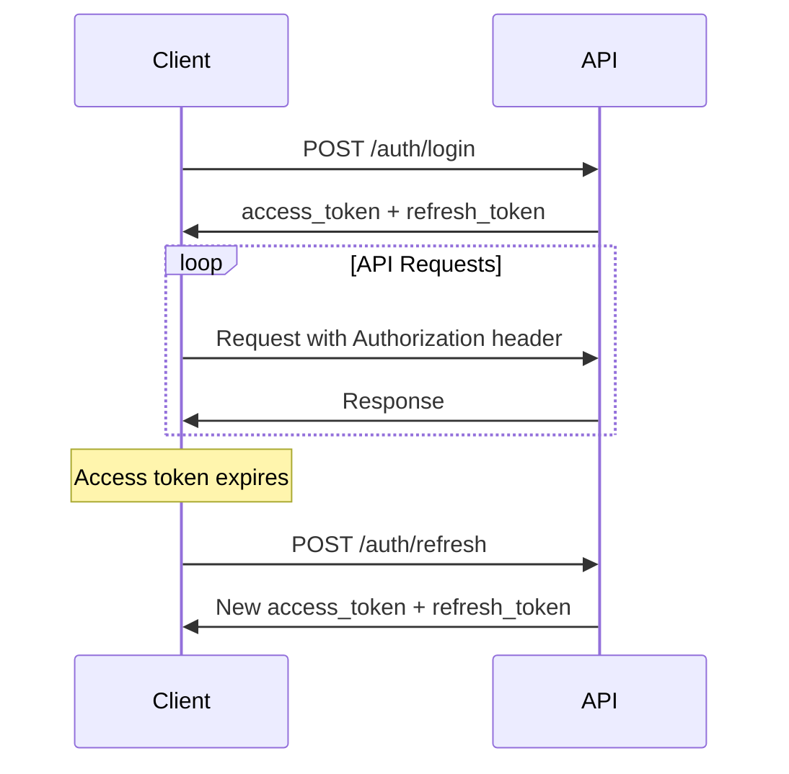

# Content Protection Platform API - Developer Guide

## Overview

The Content Protection Platform API is a comprehensive RESTful service that provides AI-powered content protection, DMCA takedown automation, and social media monitoring capabilities. This guide will help you integrate with our platform quickly and effectively.

## Table of Contents

1. [Quick Start](#quick-start)
2. [Authentication](#authentication)
3. [API Concepts](#api-concepts)
4. [Core Workflows](#core-workflows)
5. [Rate Limits](#rate-limits)
6. [Error Handling](#error-handling)
7. [Webhooks](#webhooks)
8. [SDKs](#sdks)
9. [Examples](#examples)

## Quick Start

### 1. Get Your API Credentials

1. Sign up at [https://contentprotection.ai](https://contentprotection.ai)
2. Complete email verification
3. Navigate to Settings > API Keys
4. Generate your API key

### 2. Make Your First API Call

```bash
curl -X GET "https://api.contentprotection.ai/api/v1/auth/me" \
  -H "Authorization: Bearer YOUR_JWT_TOKEN" \
  -H "Content-Type: application/json"
```

### 3. Test Authentication

```python
import requests

# Login to get JWT tokens
response = requests.post(
    "https://api.contentprotection.ai/api/v1/auth/login",
    json={
        "email": "your-email@example.com",
        "password": "your-password",
        "remember_me": True
    }
)

tokens = response.json()
access_token = tokens["access_token"]

# Use the token for subsequent requests
headers = {"Authorization": f"Bearer {access_token}"}
```

## Authentication

### JWT Token Authentication

The API uses JWT (JSON Web Tokens) for authentication. Tokens are obtained through the login endpoint and must be included in the `Authorization` header for all authenticated requests.

#### Token Types

- **Access Token**: Short-lived (30 minutes default), used for API requests
- **Refresh Token**: Long-lived (7 days default), used to obtain new access tokens

#### Authentication Flow



#### Example: Complete Authentication Flow

```python
import requests
from datetime import datetime, timedelta

class ContentProtectionAPI:
    def __init__(self, base_url="https://api.contentprotection.ai"):
        self.base_url = base_url
        self.access_token = None
        self.refresh_token = None
        self.token_expires_at = None
    
    def login(self, email, password, remember_me=False):
        """Authenticate and store tokens"""
        response = requests.post(
            f"{self.base_url}/api/v1/auth/login",
            json={
                "email": email,
                "password": password,
                "remember_me": remember_me
            }
        )
        response.raise_for_status()
        
        data = response.json()
        self.access_token = data["access_token"]
        self.refresh_token = data["refresh_token"]
        
        # Calculate expiration time
        expires_in = data["expires_in"]
        self.token_expires_at = datetime.now() + timedelta(seconds=expires_in)
        
        return data
    
    def refresh_access_token(self):
        """Refresh the access token"""
        if not self.refresh_token:
            raise ValueError("No refresh token available")
        
        response = requests.post(
            f"{self.base_url}/api/v1/auth/refresh",
            json={"refresh_token": self.refresh_token}
        )
        response.raise_for_status()
        
        data = response.json()
        self.access_token = data["access_token"]
        self.refresh_token = data["refresh_token"]
        
        expires_in = data["expires_in"]
        self.token_expires_at = datetime.now() + timedelta(seconds=expires_in)
        
        return data
    
    def get_headers(self):
        """Get authentication headers, refreshing token if needed"""
        # Check if token needs refresh
        if (self.token_expires_at and 
            datetime.now() >= self.token_expires_at - timedelta(minutes=5)):
            self.refresh_access_token()
        
        return {
            "Authorization": f"Bearer {self.access_token}",
            "Content-Type": "application/json"
        }
    
    def make_request(self, method, endpoint, **kwargs):
        """Make authenticated API request"""
        url = f"{self.base_url}{endpoint}"
        headers = self.get_headers()
        
        if 'headers' in kwargs:
            headers.update(kwargs['headers'])
        kwargs['headers'] = headers
        
        response = requests.request(method, url, **kwargs)
        response.raise_for_status()
        return response.json()

# Usage
api = ContentProtectionAPI()
api.login("your-email@example.com", "your-password")

# Now make authenticated requests
profile = api.make_request("GET", "/api/v1/profiles/123")
```

## API Concepts

### Protected Profiles

A protected profile represents a creator's identity that needs protection. Each profile contains:

- **Reference Content**: Original images/videos for AI training
- **AI Signatures**: Generated facial encodings and content hashes
- **Monitoring Settings**: Scan frequency and platform preferences
- **Keywords**: Search terms related to the creator

### Content Scanning

The platform uses multiple AI technologies to detect unauthorized content:

- **Facial Recognition**: Detects faces in images/videos
- **Content Similarity**: Compares visual features and hashes
- **Keyword Matching**: Searches for relevant terms
- **Metadata Analysis**: Examines EXIF data and watermarks

### Infringements

When unauthorized content is detected, it creates an infringement record containing:

- **Evidence**: Screenshots and URLs of violations
- **Confidence Score**: AI certainty of the match (0.0-1.0)
- **Platform Information**: Where the content was found
- **Match Type**: How the content was detected

### Takedown Requests

Automated DMCA takedown requests can be submitted to platforms:

- **Templates**: Customizable legal notice templates
- **Status Tracking**: Monitor takedown progress
- **Evidence Package**: Automated evidence compilation

## Core Workflows

### 1. Setting Up Content Protection

```python
# 1. Create a protected profile
profile_data = {
    "name": "Creator Name",
    "platform": "onlyfans",
    "username": "creator_username",
    "keywords": ["creator name", "username"],
    "monitoring_enabled": True
}

profile = api.make_request("POST", "/api/v1/profiles", json=profile_data)
profile_id = profile["id"]

# 2. Upload reference content for AI training
reference_images = [
    "https://example.com/ref1.jpg",
    "https://example.com/ref2.jpg"
]

signatures = api.make_request(
    "POST", 
    f"/api/v1/scanning/profile/signatures",
    json={
        "profile_id": profile_id,
        "image_urls": reference_images
    }
)

# 3. Configure monitoring schedule
schedule_config = {
    "profile_id": profile_id,
    "schedule": {
        "frequency": "daily",
        "time": "02:00",
        "platforms": ["google", "bing", "social_media"]
    }
}

api.make_request("POST", "/api/v1/scanning/scan/schedule", json=schedule_config)
```

### 2. Manual Content Scanning

```python
# Trigger immediate scan
scan_result = api.make_request(
    "POST",
    "/api/v1/scanning/scan/manual",
    params={"profile_id": profile_id}
)

job_id = scan_result["job_id"]

# Check scan status
import time

while True:
    status = api.make_request("GET", f"/api/v1/scanning/scan/status/{job_id}")
    
    if status["status"] == "completed":
        print(f"Scan completed! Found {len(status['results'])} potential matches")
        break
    elif status["status"] == "failed":
        print(f"Scan failed: {status.get('error')}")
        break
    
    time.sleep(30)  # Wait 30 seconds before checking again
```

### 3. Processing Infringements

```python
# Get detected infringements
infringements = api.make_request(
    "GET", 
    "/api/v1/infringements",
    params={
        "profile_id": profile_id,
        "status": "detected",
        "limit": 50
    }
)

for infringement in infringements["items"]:
    if infringement["confidence_score"] > 0.85:
        # High confidence - submit takedown
        takedown_data = {
            "infringement_id": infringement["id"],
            "urgency": "high",
            "additional_info": "Unauthorized use of copyrighted content"
        }
        
        takedown = api.make_request(
            "POST",
            "/api/v1/takedowns",
            json=takedown_data
        )
        
        print(f"Takedown submitted: {takedown['id']}")
```

### 4. Monitoring Takedown Status

```python
# Get all takedown requests
takedowns = api.make_request("GET", "/api/v1/takedowns")

for takedown in takedowns["items"]:
    print(f"Takedown {takedown['id']}: {takedown['status']}")
    
    if takedown["status"] == "completed":
        print(f"  ✅ Successfully removed from {takedown['platform']}")
    elif takedown["status"] == "rejected":
        print(f"  ❌ Rejected: {takedown['rejection_reason']}")
    elif takedown["status"] == "pending":
        print(f"  ⏳ Submitted on {takedown['submitted_at']}")
```

## Rate Limits

The API implements rate limiting to ensure fair usage:

### Authentication Endpoints
- **Login**: 5 attempts per 15 minutes per IP
- **Registration**: 3 attempts per hour per IP
- **Password Reset**: 3 attempts per hour per IP

### Scanning Endpoints
| Plan | Manual Scans | URL Scans | Profile Updates |
|------|-------------|-----------|-----------------|
| Free | 10/day | 100/day | 5/day |
| Premium | 50/day | 500/day | 25/day |
| Enterprise | Unlimited | Unlimited | Unlimited |

### Takedown Endpoints
| Plan | Takedown Requests | Status Checks |
|------|------------------|---------------|
| Free | 10/month | 1000/day |
| Premium | 100/month | 5000/day |
| Enterprise | Unlimited | Unlimited |

### Rate Limit Headers

All responses include rate limit information:

```http
X-RateLimit-Limit: 100
X-RateLimit-Remaining: 95
X-RateLimit-Reset: 1640995200
X-RateLimit-Retry-After: 3600
```

### Handling Rate Limits

```python
import time

def make_request_with_retry(api, method, endpoint, max_retries=3, **kwargs):
    for attempt in range(max_retries):
        try:
            return api.make_request(method, endpoint, **kwargs)
        except requests.exceptions.HTTPError as e:
            if e.response.status_code == 429:
                # Rate limited
                retry_after = int(e.response.headers.get('X-RateLimit-Retry-After', 60))
                print(f"Rate limited. Waiting {retry_after} seconds...")
                time.sleep(retry_after)
                continue
            raise
    
    raise Exception(f"Max retries ({max_retries}) exceeded")
```

## Error Handling

### Standard Error Response Format

```json
{
  "detail": "Error description",
  "error_code": "VALIDATION_ERROR",
  "error_id": "err_12345abc",
  "timestamp": "2024-01-15T10:30:00Z",
  "path": "/api/v1/auth/login"
}
```

### Common Error Codes

| HTTP Status | Error Code | Description |
|-------------|------------|-------------|
| 400 | `VALIDATION_ERROR` | Request validation failed |
| 401 | `AUTHENTICATION_REQUIRED` | Valid JWT token required |
| 401 | `INVALID_CREDENTIALS` | Email or password incorrect |
| 403 | `INSUFFICIENT_PERMISSIONS` | User lacks required permissions |
| 404 | `RESOURCE_NOT_FOUND` | Requested resource doesn't exist |
| 409 | `RESOURCE_CONFLICT` | Resource already exists |
| 422 | `UNPROCESSABLE_ENTITY` | Semantic validation error |
| 429 | `RATE_LIMIT_EXCEEDED` | Too many requests |
| 500 | `INTERNAL_ERROR` | Server error occurred |

### Error Handling Best Practices

```python
import requests
import logging

logger = logging.getLogger(__name__)

def handle_api_error(response):
    """Handle API errors with appropriate logging and user feedback"""
    try:
        error_data = response.json()
    except ValueError:
        error_data = {"detail": "Unknown error occurred"}
    
    status_code = response.status_code
    error_detail = error_data.get("detail", "Unknown error")
    error_code = error_data.get("error_code", "UNKNOWN")
    error_id = error_data.get("error_id")
    
    # Log the error
    logger.error(f"API Error {status_code}: {error_code} - {error_detail} (ID: {error_id})")
    
    # Handle specific error types
    if status_code == 401:
        if error_code == "AUTHENTICATION_REQUIRED":
            raise AuthenticationError("Please log in to continue")
        elif error_code == "INVALID_CREDENTIALS":
            raise AuthenticationError("Invalid email or password")
    
    elif status_code == 403:
        raise PermissionError(f"Access denied: {error_detail}")
    
    elif status_code == 404:
        raise ResourceNotFoundError(f"Resource not found: {error_detail}")
    
    elif status_code == 429:
        retry_after = int(response.headers.get('X-RateLimit-Retry-After', 60))
        raise RateLimitError(f"Rate limit exceeded. Try again in {retry_after} seconds")
    
    elif status_code >= 500:
        raise ServerError(f"Server error: {error_detail} (Report ID: {error_id})")
    
    else:
        raise APIError(f"API error: {error_detail}")

# Custom exception classes
class APIError(Exception):
    pass

class AuthenticationError(APIError):
    pass

class PermissionError(APIError):
    pass

class ResourceNotFoundError(APIError):
    pass

class RateLimitError(APIError):
    pass

class ServerError(APIError):
    pass
```

## Webhooks

The platform supports webhooks for real-time notifications about scan results, takedown status changes, and other events.

### Setting Up Webhooks

```python
# Configure webhook endpoint
webhook_config = {
    "url": "https://your-app.com/webhooks/contentprotection",
    "events": [
        "scan.completed",
        "infringement.detected", 
        "takedown.status_changed"
    ],
    "secret": "your-webhook-secret"
}

webhook = api.make_request("POST", "/api/v1/webhooks", json=webhook_config)
```

### Webhook Events

#### Scan Completed

```json
{
  "event": "scan.completed",
  "timestamp": "2024-01-15T10:30:00Z",
  "data": {
    "job_id": "scan_12345abc",
    "profile_id": 42,
    "results": {
      "infringements_found": 5,
      "new_infringements": 3,
      "scanned_urls": 150
    }
  }
}
```

#### Takedown Status Changed

```json
{
  "event": "takedown.status_changed",
  "timestamp": "2024-01-15T10:30:00Z",
  "data": {
    "takedown_id": "td_12345",
    "old_status": "pending",
    "new_status": "completed",
    "platform": "google",
    "url": "https://example.com/removed-content"
  }
}
```

### Webhook Verification

```python
import hmac
import hashlib

def verify_webhook_signature(payload, signature, secret):
    """Verify webhook signature for security"""
    expected_signature = hmac.new(
        secret.encode(),
        payload.encode(),
        hashlib.sha256
    ).hexdigest()
    
    return hmac.compare_digest(
        f"sha256={expected_signature}",
        signature
    )

# Flask example
from flask import Flask, request, abort

app = Flask(__name__)

@app.route('/webhooks/contentprotection', methods=['POST'])
def handle_webhook():
    signature = request.headers.get('X-ContentProtection-Signature')
    payload = request.get_data(as_text=True)
    
    if not verify_webhook_signature(payload, signature, WEBHOOK_SECRET):
        abort(401)
    
    event_data = request.get_json()
    event_type = event_data['event']
    
    if event_type == 'scan.completed':
        handle_scan_completed(event_data['data'])
    elif event_type == 'takedown.status_changed':
        handle_takedown_status_changed(event_data['data'])
    
    return {'status': 'received'}, 200
```

## SDKs

### Python SDK

Install the official Python SDK:

```bash
pip install contentprotection-python
```

Basic usage:

```python
from contentprotection import ContentProtectionClient

client = ContentProtectionClient(
    email="your-email@example.com",
    password="your-password"
)

# Create profile
profile = client.profiles.create(
    name="Creator Name",
    platform="onlyfans",
    username="creator"
)

# Upload reference content
client.scanning.upload_reference_content(
    profile_id=profile.id,
    image_urls=["https://example.com/ref1.jpg"]
)

# Trigger scan
scan = client.scanning.manual_scan(profile_id=profile.id)

# Wait for results
results = scan.wait_for_completion(timeout=300)
print(f"Found {len(results.infringements)} potential matches")
```

### JavaScript SDK

Install via npm:

```bash
npm install @contentprotection/api-client
```

Basic usage:

```javascript
import { ContentProtectionClient } from '@contentprotection/api-client';

const client = new ContentProtectionClient({
  email: 'your-email@example.com',
  password: 'your-password'
});

// Create profile
const profile = await client.profiles.create({
  name: 'Creator Name',
  platform: 'onlyfans',
  username: 'creator'
});

// Trigger scan
const scan = await client.scanning.manualScan({
  profileId: profile.id
});

// Monitor progress
scan.on('progress', (status) => {
  console.log(`Scan progress: ${status.completed}/${status.total}`);
});

scan.on('completed', (results) => {
  console.log(`Found ${results.infringements.length} potential matches`);
});
```

## Support

- **Documentation**: [https://docs.contentprotection.ai](https://docs.contentprotection.ai)
- **API Reference**: [https://api.contentprotection.ai/docs](https://api.contentprotection.ai/docs)
- **Support**: [support@contentprotection.ai](mailto:support@contentprotection.ai)
- **Status Page**: [https://status.contentprotection.ai](https://status.contentprotection.ai)

## Changelog

### v1.0.0 (Current)
- Initial API release
- JWT authentication
- Content scanning and AI detection
- DMCA takedown automation
- Webhook support
- Rate limiting and security features