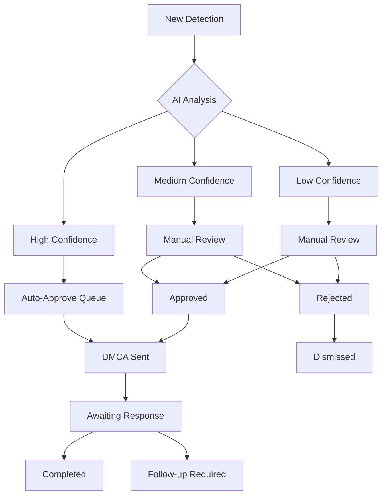

# ShieldMyContent - Content Protection Workbench Design Specification

## Table of Contents
- [Overview](#overview)
- [Layout Architecture](#layout-architecture)
- [Visual Design System](#visual-design-system)
- [Components Breakdown](#components-breakdown)
- [Task Management System](#task-management-system)
- [AI Integration Interface](#ai-integration-interface)
- [Batch Operations](#batch-operations)
- [Real-time Updates](#real-time-updates)
- [Interactive Elements](#interactive-elements)
- [States & Loading](#states--loading)
- [Error Handling](#error-handling)
- [Accessibility](#accessibility)
- [Performance Requirements](#performance-requirements)
- [Responsive Design](#responsive-design)
- [Implementation Notes](#implementation-notes)

---

## Overview

### Purpose
The Content Protection Workbench serves as the advanced command center for managing content protection tasks, AI-powered threat detection, batch operations, and comprehensive workflow automation for content creators and protection professionals.

### Business Requirements
- **Primary Goal**: Streamline content protection workflow management
- **Secondary Goals**: Enable AI-assisted decision making, batch processing efficiency
- **User Types**: Power users, content protection professionals, business accounts
- **Efficiency Target**: >70% workflow automation, <5 minutes per task resolution

### Success Metrics
- Task completion rate > 90%
- Average task resolution time < 5 minutes
- AI suggestion acceptance rate > 80%
- User productivity increase > 300%

---

## Layout Architecture

### Overall Structure
```
┌─────────────────────────────────────────────────────────────────┐
│                    Workbench Header                             │
├─────────────────────┬───────────────────────┬───────────────────┤
│                     │                       │                   │
│   Filter & Search   │    Main Task Area     │   Action Panel   │
│      Sidebar        │                       │                   │
│                     │  ┌─────────────────┐  │                   │
│  ┌───────────────┐  │  │     Task 1      │  │  ┌─────────────┐ │
│  │   Filters     │  │  ├─────────────────┤  │  │   Bulk      │ │
│  │               │  │  │     Task 2      │  │  │  Actions    │ │
│  ├───────────────┤  │  ├─────────────────┤  │  ├─────────────┤ │
│  │   Quick       │  │  │     Task 3      │  │  │   AI        │ │
│  │   Actions     │  │  ├─────────────────┤  │  │ Insights    │ │
│  ├───────────────┤  │  │     Task 4      │  │  ├─────────────┤ │
│  │   Saved       │  │  └─────────────────┘  │  │  Selected   │ │
│  │   Views       │  │                       │  │   Items     │ │
│  └───────────────┘  │                       │  └─────────────┘ │
└─────────────────────┴───────────────────────┴───────────────────┘
```

### Grid System
- **Three-column layout**: 300px | Flexible | 280px
- **Task Cards**: Uniform height with expandable details
- **Responsive Collapse**: Sidebars collapse on smaller screens
- **Virtualized Scrolling**: Handle 1000+ tasks efficiently

---

## Visual Design System

### Color Palette

#### Priority Colors
- **Critical**: `#ef4444` (Red) - Immediate action required
- **High**: `#f59e0b` (Orange) - High priority tasks
- **Medium**: `#3b82f6` (Blue) - Standard priority
- **Low**: `#6b7280` (Gray) - Low priority tasks

#### Status Colors
- **New Detection**: `#8b5cf6` (Purple) - Recently detected
- **In Progress**: `#f59e0b` (Orange) - Being processed
- **Awaiting Response**: `#3b82f6` (Blue) - Waiting for external response
- **Completed**: `#10b981` (Green) - Successfully resolved
- **Rejected**: `#6b7280` (Gray) - Dismissed or invalid

#### AI Confidence Colors
- **High Confidence (90-100%)**: `#10b981` (Green)
- **Medium Confidence (70-89%)**: `#f59e0b` (Orange)  
- **Low Confidence (50-69%)**: `#ef4444` (Red)
- **Very Low (<50%)**: `#6b7280` (Gray)

### Typography
- **Task Titles**: 16px / 24px, Semi-Bold (600)
- **Task Descriptions**: 14px / 20px, Regular (400)
- **Metadata**: 12px / 16px, Medium (500)
- **AI Insights**: 13px / 18px, Regular (400)
- **Action Labels**: 14px / 20px, Medium (500)

---

## Components Breakdown

### 1. Workbench Header

#### Header Container
```css
Workbench Header {
  background: #ffffff;
  border-bottom: 1px solid #e5e7eb;
  padding: 20px 24px;
  position: sticky;
  top: 0;
  z-index: 100;
}

Header Content {
  display: flex;
  justify-content: space-between;
  align-items: center;
  max-width: none;
}

Header Title Section {
  display: flex;
  align-items: center;
  gap: 16px;
}

Header Title {
  font-size: 24px;
  font-weight: 700;
  color: #111827;
  margin: 0;
}

Header Status {
  display: flex;
  align-items: center;
  gap: 20px;
}

Status Indicator {
  display: flex;
  align-items: center;
  gap: 8px;
  font-size: 14px;
  font-weight: 500;
}

Status Dot {
  width: 8px;
  height: 8px;
  border-radius: 50%;
  background: var(--status-color);
}

Live Updates Toggle {
  background: #f3f4f6;
  border: 1px solid #d1d5db;
  border-radius: 6px;
  padding: 8px 16px;
  font-size: 14px;
  cursor: pointer;
  transition: all 0.15s ease;
}

Live Updates Toggle.active {
  background: #3b82f6;
  color: #ffffff;
  border-color: #3b82f6;
}
```

**Header Elements:**
- Title: "Content Protection Workbench"
- Live status: Real-time connection indicator
- Task counter: "247 active tasks"
- Auto-refresh toggle
- View options (List/Grid/Timeline)

### 2. Filter & Search Sidebar

#### Sidebar Container
```css
Filter Sidebar {
  width: 300px;
  background: #ffffff;
  border-right: 1px solid #e5e7eb;
  padding: 24px;
  height: calc(100vh - 80px);
  overflow-y: auto;
  position: sticky;
  top: 80px;
}

Filter Section {
  margin-bottom: 32px;
}

Filter Title {
  font-size: 16px;
  font-weight: 600;
  color: #111827;
  margin-bottom: 16px;
  display: flex;
  align-items: center;
  justify-content: space-between;
}

Filter Clear {
  font-size: 12px;
  color: #6b7280;
  cursor: pointer;
  text-decoration: none;
}

Filter Clear:hover {
  color: #3b82f6;
  text-decoration: underline;
}
```

#### Search Bar
```css
Search Container {
  position: relative;
  margin-bottom: 24px;
}

Search Input {
  width: 100%;
  padding: 12px 16px 12px 40px;
  border: 2px solid #e5e7eb;
  border-radius: 8px;
  font-size: 14px;
  background: #ffffff;
  transition: border-color 0.15s ease;
}

Search Input:focus {
  outline: none;
  border-color: #3b82f6;
  box-shadow: 0 0 0 3px rgba(59, 130, 246, 0.1);
}

Search Icon {
  position: absolute;
  left: 12px;
  top: 50%;
  transform: translateY(-50%);
  color: #9ca3af;
  font-size: 16px;
}

Search Clear {
  position: absolute;
  right: 12px;
  top: 50%;
  transform: translateY(-50%);
  background: none;
  border: none;
  color: #6b7280;
  cursor: pointer;
  padding: 4px;
  border-radius: 4px;
}
```

#### Filter Groups
```css
Filter Group {
  margin-bottom: 24px;
}

Filter Options {
  display: flex;
  flex-direction: column;
  gap: 8px;
}

Filter Option {
  display: flex;
  align-items: center;
  gap: 12px;
  padding: 8px 12px;
  border-radius: 6px;
  cursor: pointer;
  transition: background-color 0.15s ease;
}

Filter Option:hover {
  background: #f3f4f6;
}

Filter Option.active {
  background: #eff6ff;
  color: #1d4ed8;
}

Filter Checkbox {
  width: 16px;
  height: 16px;
  border: 2px solid #d1d5db;
  border-radius: 4px;
  position: relative;
}

Filter Checkbox.checked {
  background: #3b82f6;
  border-color: #3b82f6;
}

Filter Label {
  font-size: 14px;
  flex: 1;
}

Filter Count {
  font-size: 12px;
  color: #6b7280;
  background: #f3f4f6;
  padding: 2px 8px;
  border-radius: 10px;
}
```

**Filter Categories:**
- **Status**: New, In Progress, Awaiting Response, Completed
- **Priority**: Critical, High, Medium, Low
- **Platform**: OnlyFans, Instagram, Twitter, Reddit, Other
- **Confidence**: High (90-100%), Medium (70-89%), Low (50-69%)
- **Content Type**: Images, Videos, Text, Mixed
- **Date Range**: Today, This Week, This Month, Custom
- **Profiles**: User's creator profiles

#### Quick Actions Panel
```css
Quick Actions {
  background: #f8fafc;
  border: 1px solid #e2e8f0;
  border-radius: 8px;
  padding: 16px;
  margin-bottom: 24px;
}

Quick Action Button {
  width: 100%;
  padding: 10px 16px;
  margin-bottom: 8px;
  background: #ffffff;
  border: 1px solid #d1d5db;
  border-radius: 6px;
  font-size: 14px;
  color: #374151;
  cursor: pointer;
  text-align: left;
  transition: all 0.15s ease;
}

Quick Action Button:hover {
  background: #f9fafb;
  border-color: #3b82f6;
  color: #1d4ed8;
}

Quick Action Icon {
  margin-right: 8px;
  font-size: 16px;
}
```

**Quick Actions:**
- ⚡ Auto-approve high confidence
- 📧 Send pending DMCA notices
- 🔄 Refresh all scans
- 📊 Generate weekly report
- ⚙️ Update protection settings
- 🎯 Create new profile

### 3. Main Task Area

#### Task List Container
```css
Task Area {
  flex: 1;
  padding: 24px;
  background: #f9fafb;
  height: calc(100vh - 80px);
  overflow-y: auto;
}

Task List {
  display: flex;
  flex-direction: column;
  gap: 16px;
  max-width: 800px;
  margin: 0 auto;
}

Task Card {
  background: #ffffff;
  border: 1px solid #e5e7eb;
  border-radius: 12px;
  padding: 20px;
  transition: all 0.15s ease;
  position: relative;
  cursor: pointer;
}

Task Card:hover {
  box-shadow: 0 4px 6px -1px rgba(0, 0, 0, 0.1);
  border-color: #3b82f6;
  transform: translateY(-1px);
}

Task Card.selected {
  border-color: #3b82f6;
  box-shadow: 0 0 0 3px rgba(59, 130, 246, 0.1);
}

Task Card.critical {
  border-left: 4px solid #ef4444;
}

Task Card.high {
  border-left: 4px solid #f59e0b;
}

Task Card.medium {
  border-left: 4px solid #3b82f6;
}

Task Card.low {
  border-left: 4px solid #6b7280;
}
```

#### Task Card Header
```css
Task Header {
  display: flex;
  justify-content: space-between;
  align-items: flex-start;
  margin-bottom: 16px;
}

Task Title Section {
  flex: 1;
  margin-right: 16px;
}

Task Title {
  font-size: 16px;
  font-weight: 600;
  color: #111827;
  margin-bottom: 4px;
  line-height: 1.4;
}

Task Meta {
  display: flex;
  align-items: center;
  gap: 12px;
  font-size: 12px;
  color: #6b7280;
}

Task Meta Item {
  display: flex;
  align-items: center;
  gap: 4px;
}

Task Actions {
  display: flex;
  align-items: center;
  gap: 8px;
}

Task Checkbox {
  width: 20px;
  height: 20px;
  border: 2px solid #d1d5db;
  border-radius: 4px;
  cursor: pointer;
  transition: all 0.15s ease;
}

Task Checkbox.checked {
  background: #3b82f6;
  border-color: #3b82f6;
}

Priority Badge {
  padding: 4px 8px;
  border-radius: 12px;
  font-size: 10px;
  font-weight: 600;
  text-transform: uppercase;
  letter-spacing: 0.5px;
}

Priority Badge.critical {
  background: #fef2f2;
  color: #991b1b;
}

Priority Badge.high {
  background: #fffbeb;
  color: #92400e;
}

Priority Badge.medium {
  background: #eff6ff;
  color: #1e40af;
}

Priority Badge.low {
  background: #f3f4f6;
  color: #4b5563;
}
```

#### Task Card Content
```css
Task Content {
  display: grid;
  grid-template-columns: auto 1fr auto;
  gap: 16px;
  align-items: center;
  margin-bottom: 16px;
}

Task Thumbnail {
  width: 80px;
  height: 80px;
  border-radius: 8px;
  object-fit: cover;
  background: #f3f4f6;
  flex-shrink: 0;
}

Task Details {
  flex: 1;
  min-width: 0;
}

Task Description {
  color: #4b5563;
  font-size: 14px;
  line-height: 1.5;
  margin-bottom: 12px;
}

Task Platform {
  display: flex;
  align-items: center;
  gap: 8px;
  margin-bottom: 8px;
}

Platform Icon {
  width: 20px;
  height: 20px;
  border-radius: 4px;
}

Platform Name {
  font-size: 14px;
  font-weight: 500;
  color: #374151;
}

Task URL {
  font-size: 12px;
  color: #6b7280;
  font-family: monospace;
  word-break: break-all;
  background: #f3f4f6;
  padding: 4px 8px;
  border-radius: 4px;
  margin-bottom: 12px;
}

Task Confidence {
  display: flex;
  align-items: center;
  gap: 8px;
  font-size: 13px;
  font-weight: 500;
}

Confidence Meter {
  width: 60px;
  height: 4px;
  background: #e5e7eb;
  border-radius: 2px;
  overflow: hidden;
}

Confidence Fill {
  height: 100%;
  background: var(--confidence-color);
  transition: width 0.3s ease;
}

Confidence Percentage {
  color: var(--confidence-color);
}
```

#### AI Insights Panel
```css
AI Insights {
  background: #f8fafc;
  border: 1px solid #e2e8f0;
  border-radius: 8px;
  padding: 16px;
  margin-top: 16px;
  position: relative;
}

AI Label {
  display: flex;
  align-items: center;
  gap: 8px;
  font-size: 12px;
  font-weight: 600;
  color: #6366f1;
  margin-bottom: 8px;
}

AI Icon {
  width: 16px;
  height: 16px;
  background: #6366f1;
  border-radius: 50%;
  color: #ffffff;
  display: flex;
  align-items: center;
  justify-content: center;
  font-size: 8px;
}

AI Reasoning {
  color: #4b5563;
  font-size: 14px;
  line-height: 1.5;
  margin-bottom: 12px;
}

AI Recommendations {
  display: flex;
  gap: 8px;
  flex-wrap: wrap;
}

AI Recommendation {
  background: #eff6ff;
  color: #1e40af;
  padding: 6px 12px;
  border-radius: 16px;
  font-size: 12px;
  font-weight: 500;
  border: 1px solid #bfdbfe;
  cursor: pointer;
  transition: all 0.15s ease;
}

AI Recommendation:hover {
  background: #dbeafe;
  border-color: #93c5fd;
}
```

#### Task Footer
```css
Task Footer {
  display: flex;
  justify-content: space-between;
  align-items: center;
  padding-top: 16px;
  border-top: 1px solid #e5e7eb;
  margin-top: 16px;
}

Task Actions Left {
  display: flex;
  gap: 8px;
}

Task Actions Right {
  display: flex;
  gap: 8px;
}

Action Button {
  padding: 8px 16px;
  border-radius: 6px;
  font-size: 14px;
  font-weight: 500;
  border: 1px solid;
  cursor: pointer;
  transition: all 0.15s ease;
}

Action Button.primary {
  background: #3b82f6;
  border-color: #3b82f6;
  color: #ffffff;
}

Action Button.primary:hover {
  background: #1d4ed8;
  border-color: #1d4ed8;
}

Action Button.secondary {
  background: #ffffff;
  border-color: #d1d5db;
  color: #374151;
}

Action Button.secondary:hover {
  background: #f9fafb;
  border-color: #9ca3af;
}

Action Button.danger {
  background: #ffffff;
  border-color: #fca5a5;
  color: #dc2626;
}

Action Button.danger:hover {
  background: #fef2f2;
  border-color: #f87171;
}

Task Timestamp {
  font-size: 12px;
  color: #9ca3af;
}
```

### 4. Action Panel Sidebar

#### Action Panel Container
```css
Action Panel {
  width: 280px;
  background: #ffffff;
  border-left: 1px solid #e5e7eb;
  padding: 24px;
  height: calc(100vh - 80px);
  overflow-y: auto;
  position: sticky;
  top: 80px;
}

Panel Section {
  margin-bottom: 32px;
}

Panel Title {
  font-size: 16px;
  font-weight: 600;
  color: #111827;
  margin-bottom: 16px;
  display: flex;
  align-items: center;
  gap: 8px;
}

Panel Title Icon {
  width: 20px;
  height: 20px;
  color: #6b7280;
}
```

#### Bulk Actions Panel
```css
Bulk Actions {
  background: #f8fafc;
  border: 1px solid #e2e8f0;
  border-radius: 8px;
  padding: 16px;
  margin-bottom: 24px;
}

Bulk Header {
  display: flex;
  justify-content: space-between;
  align-items: center;
  margin-bottom: 16px;
}

Selected Count {
  font-size: 14px;
  font-weight: 500;
  color: #374151;
}

Clear Selection {
  font-size: 12px;
  color: #6b7280;
  cursor: pointer;
  text-decoration: none;
}

Clear Selection:hover {
  color: #3b82f6;
  text-decoration: underline;
}

Bulk Action Button {
  width: 100%;
  padding: 10px 16px;
  margin-bottom: 8px;
  background: #ffffff;
  border: 1px solid #d1d5db;
  border-radius: 6px;
  font-size: 14px;
  color: #374151;
  cursor: pointer;
  text-align: left;
  transition: all 0.15s ease;
  display: flex;
  align-items: center;
  gap: 8px;
}

Bulk Action Button:hover {
  background: #f9fafb;
  border-color: #3b82f6;
  color: #1d4ed8;
}

Bulk Action Button.danger:hover {
  border-color: #ef4444;
  color: #dc2626;
}

Bulk Action Icon {
  font-size: 16px;
}
```

**Bulk Actions:**
- ✅ Approve selected (high confidence)
- ❌ Reject selected
- 📧 Send DMCA notices
- 🏷️ Add tags to selected
- 📂 Move to folder
- 🗑️ Delete selected

#### AI Insights Summary
```css
AI Summary {
  background: linear-gradient(135deg, #6366f1 0%, #8b5cf6 100%);
  color: #ffffff;
  border-radius: 12px;
  padding: 20px;
  margin-bottom: 24px;
}

AI Summary Title {
  font-size: 16px;
  font-weight: 600;
  margin-bottom: 12px;
}

AI Statistics {
  display: grid;
  grid-template-columns: 1fr 1fr;
  gap: 16px;
  margin-bottom: 16px;
}

AI Stat {
  text-align: center;
}

AI Stat Value {
  font-size: 24px;
  font-weight: 700;
  display: block;
}

AI Stat Label {
  font-size: 12px;
  opacity: 0.9;
}

AI Recommendations List {
  font-size: 14px;
  line-height: 1.6;
}
```

#### Selected Items Panel
```css
Selected Items {
  border: 1px solid #e5e7eb;
  border-radius: 8px;
  overflow: hidden;
}

Selected Header {
  background: #f9fafb;
  padding: 12px 16px;
  border-bottom: 1px solid #e5e7eb;
  font-size: 14px;
  font-weight: 500;
  color: #374151;
}

Selected List {
  max-height: 300px;
  overflow-y: auto;
}

Selected Item {
  display: flex;
  align-items: center;
  gap: 12px;
  padding: 12px 16px;
  border-bottom: 1px solid #f3f4f6;
}

Selected Item:last-child {
  border-bottom: none;
}

Selected Thumbnail {
  width: 32px;
  height: 32px;
  border-radius: 4px;
  object-fit: cover;
  background: #f3f4f6;
  flex-shrink: 0;
}

Selected Details {
  flex: 1;
  min-width: 0;
}

Selected Title {
  font-size: 12px;
  font-weight: 500;
  color: #374151;
  margin-bottom: 2px;
  white-space: nowrap;
  overflow: hidden;
  text-overflow: ellipsis;
}

Selected Platform {
  font-size: 10px;
  color: #6b7280;
}

Deselect Button {
  width: 16px;
  height: 16px;
  border-radius: 50%;
  background: #ef4444;
  color: #ffffff;
  border: none;
  cursor: pointer;
  font-size: 10px;
  flex-shrink: 0;
}
```

---

## Task Management System

### Task States & Workflow


### Priority Scoring Algorithm
```typescript
interface PriorityFactors {
  confidence: number; // 0-100
  estimatedImpact: 'high' | 'medium' | 'low';
  platformReach: number; // estimated views
  contentValue: number; // revenue impact
  timeDecay: number; // hours since detection
  profileImportance: number; // 1-10 scale
}

const calculatePriority = (factors: PriorityFactors): 'critical' | 'high' | 'medium' | 'low' => {
  let score = 0;
  
  // Confidence weight (40%)
  score += (factors.confidence / 100) * 40;
  
  // Impact weight (25%)
  const impactScore = factors.estimatedImpact === 'high' ? 25 : 
                     factors.estimatedImpact === 'medium' ? 15 : 5;
  score += impactScore;
  
  // Platform reach (20%)
  score += Math.min((factors.platformReach / 10000) * 20, 20);
  
  // Time decay (10%)
  score += Math.max(10 - (factors.timeDecay / 24) * 10, 0);
  
  // Profile importance (5%)
  score += (factors.profileImportance / 10) * 5;
  
  if (score >= 80) return 'critical';
  if (score >= 60) return 'high';
  if (score >= 40) return 'medium';
  return 'low';
};
```

---

## AI Integration Interface

### AI Confidence Visualization
```css
Confidence Visualization {
  display: flex;
  align-items: center;
  gap: 12px;
  margin: 12px 0;
}

Confidence Chart {
  width: 60px;
  height: 60px;
  position: relative;
}

Confidence Circle {
  width: 100%;
  height: 100%;
  border-radius: 50%;
  background: conic-gradient(
    var(--confidence-color) 0deg,
    var(--confidence-color) calc(var(--confidence) * 3.6deg),
    #e5e7eb calc(var(--confidence) * 3.6deg),
    #e5e7eb 360deg
  );
  display: flex;
  align-items: center;
  justify-content: center;
}

Confidence Inner {
  width: 70%;
  height: 70%;
  background: #ffffff;
  border-radius: 50%;
  display: flex;
  align-items: center;
  justify-content: center;
  font-size: 12px;
  font-weight: 600;
  color: var(--confidence-color);
}

Confidence Details {
  flex: 1;
}

Confidence Level {
  font-size: 14px;
  font-weight: 600;
  color: var(--confidence-color);
  margin-bottom: 4px;
}

Confidence Factors {
  font-size: 12px;
  color: #6b7280;
}
```

### AI Reasoning Display
```css
AI Reasoning Panel {
  background: #f8fafc;
  border: 1px solid #e2e8f0;
  border-radius: 8px;
  padding: 16px;
  margin: 16px 0;
}

Reasoning Header {
  display: flex;
  align-items: center;
  gap: 8px;
  margin-bottom: 12px;
}

AI Brain Icon {
  width: 20px;
  height: 20px;
  background: linear-gradient(135deg, #6366f1, #8b5cf6);
  border-radius: 50%;
  display: flex;
  align-items: center;
  justify-content: center;
  color: #ffffff;
  font-size: 10px;
}

Reasoning Title {
  font-size: 14px;
  font-weight: 600;
  color: #374151;
}

Reasoning Text {
  color: #4b5563;
  font-size: 13px;
  line-height: 1.5;
  margin-bottom: 12px;
}

Reasoning Factors {
  display: flex;
  flex-wrap: wrap;
  gap: 6px;
}

Reasoning Factor {
  background: #eff6ff;
  color: #1e40af;
  padding: 4px 8px;
  border-radius: 12px;
  font-size: 11px;
  font-weight: 500;
}
```

---

## Batch Operations

### Batch Selection Interface
```css
Batch Selection Bar {
  position: sticky;
  top: 0;
  background: #3b82f6;
  color: #ffffff;
  padding: 16px 24px;
  z-index: 50;
  display: flex;
  align-items: center;
  justify-content: space-between;
  transform: translateY(-100%);
  transition: transform 0.3s ease;
}

Batch Selection Bar.visible {
  transform: translateY(0);
}

Selection Info {
  display: flex;
  align-items: center;
  gap: 16px;
}

Selection Count {
  font-size: 16px;
  font-weight: 600;
}

Selection Actions {
  display: flex;
  gap: 8px;
}

Batch Action Button {
  background: rgba(255, 255, 255, 0.1);
  border: 1px solid rgba(255, 255, 255, 0.2);
  color: #ffffff;
  padding: 8px 16px;
  border-radius: 6px;
  font-size: 14px;
  cursor: pointer;
  transition: all 0.15s ease;
  backdrop-filter: blur(10px);
}

Batch Action Button:hover {
  background: rgba(255, 255, 255, 0.2);
  border-color: rgba(255, 255, 255, 0.4);
}

Clear Selection Button {
  background: none;
  border: 1px solid rgba(255, 255, 255, 0.3);
  color: #ffffff;
  padding: 8px 12px;
  border-radius: 6px;
  font-size: 14px;
  cursor: pointer;
}
```

### Batch Progress Modal
```css
Batch Modal {
  position: fixed;
  top: 0;
  left: 0;
  width: 100%;
  height: 100%;
  background: rgba(0, 0, 0, 0.5);
  display: flex;
  align-items: center;
  justify-content: center;
  z-index: 1000;
}

Batch Modal Content {
  background: #ffffff;
  border-radius: 12px;
  padding: 32px;
  max-width: 500px;
  width: 90%;
  max-height: 80vh;
  overflow-y: auto;
}

Batch Progress Header {
  text-align: center;
  margin-bottom: 24px;
}

Batch Progress Title {
  font-size: 20px;
  font-weight: 600;
  color: #111827;
  margin-bottom: 8px;
}

Batch Progress Subtitle {
  color: #6b7280;
  font-size: 14px;
}

Progress Bar Container {
  margin: 24px 0;
}

Progress Bar {
  width: 100%;
  height: 8px;
  background: #e5e7eb;
  border-radius: 4px;
  overflow: hidden;
}

Progress Fill {
  height: 100%;
  background: linear-gradient(90deg, #3b82f6 0%, #10b981 100%);
  transition: width 0.3s ease;
  border-radius: 4px;
}

Progress Stats {
  display: flex;
  justify-content: space-between;
  margin-top: 8px;
  font-size: 12px;
  color: #6b7280;
}

Batch Results {
  margin-top: 24px;
}

Result Summary {
  display: grid;
  grid-template-columns: repeat(2, 1fr);
  gap: 16px;
  margin-bottom: 24px;
}

Result Stat {
  text-align: center;
  padding: 16px;
  background: #f8fafc;
  border-radius: 8px;
}

Result Value {
  font-size: 24px;
  font-weight: 700;
  color: #111827;
  display: block;
}

Result Label {
  font-size: 12px;
  color: #6b7280;
  margin-top: 4px;
}
```

---

## Real-time Updates

### WebSocket Integration
- **Live Task Updates**: New detections appear instantly
- **Status Changes**: Real-time progress tracking
- **AI Processing**: Live confidence updates
- **Batch Operations**: Progress streaming
- **Notifications**: Important alerts and completions

### Update Animations
```css
@keyframes slideInFromTop {
  from {
    opacity: 0;
    transform: translateY(-20px);
  }
  to {
    opacity: 1;
    transform: translateY(0);
  }
}

@keyframes pulseUpdate {
  0% {
    background: #ffffff;
  }
  50% {
    background: #eff6ff;
  }
  100% {
    background: #ffffff;
  }
}

New Task {
  animation: slideInFromTop 0.3s ease-out;
}

Updated Task {
  animation: pulseUpdate 0.5s ease-out;
}

@keyframes confidenceUpdate {
  0% {
    transform: scale(1);
  }
  50% {
    transform: scale(1.05);
  }
  100% {
    transform: scale(1);
  }
}

Confidence Updated {
  animation: confidenceUpdate 0.4s ease-out;
}
```

---

## Performance Requirements

### Virtualization
- **Virtual Scrolling**: Handle 1000+ tasks without performance degradation
- **Intersection Observer**: Only render visible tasks
- **Debounced Search**: 300ms delay on search input
- **Lazy Loading**: Load task details on demand

### Optimization Strategies
- **Memoization**: React.memo for task cards
- **Debounced Updates**: Batch real-time updates
- **Progressive Loading**: Initial 50 tasks, load more on scroll
- **Image Optimization**: Thumbnail lazy loading and compression

---

## Responsive Design

### Mobile Layout (320px - 767px)
```css
Mobile Workbench {
  .workbench-layout {
    grid-template-columns: 1fr;
    grid-template-areas: 
      "header"
      "filters"
      "main"
      "actions";
  }
  
  .filter-sidebar,
  .action-panel {
    position: fixed;
    top: 0;
    left: 0;
    width: 100%;
    height: 100vh;
    background: #ffffff;
    z-index: 200;
    transform: translateX(-100%);
    transition: transform 0.3s ease;
  }
  
  .filter-sidebar.open,
  .action-panel.open {
    transform: translateX(0);
  }
  
  .task-card {
    padding: 16px;
  }
  
  .task-content {
    grid-template-columns: 1fr;
    gap: 12px;
  }
  
  .task-actions {
    flex-direction: column;
    gap: 8px;
  }
}
```

---

## Implementation Notes

### Technical Stack
- **Framework**: React 18+ with TypeScript
- **State Management**: Zustand for local state, React Query for server state
- **Virtualization**: React-window for large lists
- **Real-time**: WebSocket with automatic reconnection
- **Charts**: Chart.js for analytics visualization

### API Integration
- **GET /workbench/tasks** - Paginated task list with filters
- **POST /workbench/tasks/bulk** - Batch operations
- **PUT /workbench/tasks/:id** - Update task status
- **WebSocket /workbench** - Real-time task updates
- **POST /ai/analyze** - AI confidence analysis

### File Structure
```
src/
├── pages/
│   └── Workbench.tsx
├── components/
│   ├── workbench/
│   │   ├── TaskCard.tsx
│   │   ├── FilterSidebar.tsx
│   │   ├── ActionPanel.tsx
│   │   ├── BulkActions.tsx
│   │   ├── AIInsights.tsx
│   │   ├── TaskList.tsx
│   │   └── BatchProgress.tsx
│   └── ui/
│       ├── VirtualList.tsx
│       ├── ConfidenceChart.tsx
│       └── PriorityBadge.tsx
├── hooks/
│   ├── useWorkbenchTasks.ts
│   ├── useBatchOperations.ts
│   ├── useTaskSelection.ts
│   └── useRealTimeUpdates.ts
├── services/
│   ├── workbenchApi.ts
│   ├── aiService.ts
│   └── batchProcessor.ts
└── types/
    └── workbench.ts
```

This comprehensive specification provides everything needed to build a sophisticated, AI-powered content protection workbench that enables users to efficiently manage large volumes of content protection tasks with advanced automation and intelligent workflow management.